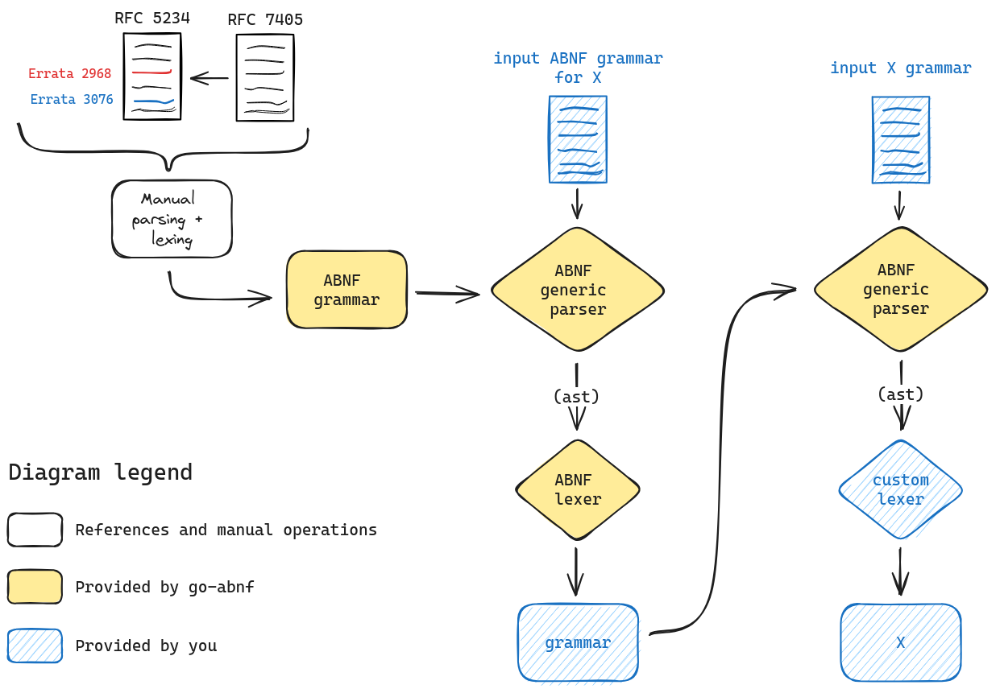

<div align="center">
	<h1>Go-ABNF</h1>
	<a href="https://pkg.go.dev/github.com/pandatix/go-abnf"></a>
	<a href="https://goreportcard.com/report/github.com/pandatix/go-abnf"></a>
	<a href="https://coveralls.io/github/pandatix/go-abnf?branch=main"></a>
	<br>
	<a href=""></a>
	<a href="https://github.com/pandatix/go-abnf/actions?query=workflow%3Aci+"></a>
	<a href="https://github.com/pandatix/go-abnf/actions/workflows/codeql-analysis.yaml"></a>
	<br>
	<a href="https://securityscorecards.dev/viewer/?uri=github.com/pandatix/go-abnf"></a>
	<a href="https://bestpractices.coreinfrastructure.org/en/projects/7840"></a>
</div>

Go module to handle Augmented Backus-Naur Form (ABNF), providing a large API.
It implements RFC 5234 and 7405, with Errata 2968 and 3076.

Capabilities:
 - [X] parse ABNF (to manipulable datastructure ; with cycle detection)
 - [X] compile ABNF to regex
 - [X] create a minimal set of tests that covers the full grammar
 - [X] generate a visual representation of the ABNF grammar provided (mermaid)
 - [X] create an ABNF fuzzer for your modules (version >= Go1.18beta1)
 - [X] support Unicode rather than UTF-8

## How it works

Under the hood, `go-abnf` is a dependency-free brute-force parser. It enumerates all possibilities for a given grammar and an input, and returns all possible paths. Those then have to be lexed in order to produce a new grammar.

As this implementation is not adhesive to the ABNF grammar of the ABNF grammar as defined in RFC 5234, updated by RFC 7405 and fixed by Erratum 2968 and 3076, it enables genericity.
This imply that for any valid grammar in ABNF that is properly lexed, if you can write a lexer for this grammar, you can parse new input with the original grammar. To init this loop, we had to hardcode the manual decomposition of the ABNF grammar, reviewed multiple times.

<div align="center">
	
</div>

Examples can be found in [the examples directory](examples/)

## Fuzzing

As go-abnf revolves around grammars, you can use a random walk to traverse its graph and efficiently generate valid inputs according to a given grammar.

This is particularly powerful when you want to fuzz Go implementations that require a very specific input format that the Go's fuzzing engine can't produce.

You can use go-abnf to efficiently produce test cases, as follows.

```go
package example

import (
	_ "embed"
	"testing"

	goabnf "github.com/pandatix/go-abnf"
)

//go:embed my-grammar.abnf
var myGrammar []byte

func FuzzFunction(f *testing.F) {
	g, err := goabnf.ParseABNF(myGrammar)
	if err != nil {
		f.Fatal(err)
	}

	f.Fuzz(func(t *testing.T, seed int64) {
		// Generate a random test case based on the seed
		b, _ := g.Generate(seed, "a",
			goabnf.WithRepMax(15),      // Limit repetitions to 15
			goabnf.WithThreshold(1024), // Stop ASAP input generation if reached 1024 bytes
		)

		Function(b)
	})
}
```

---

## Troubleshooting

### My ABNF grammar does not work

**Q**: My ABNF grammar does not work. Do you have any idea why ?

**R**: There could be many reasons to this. First make sure your grammar ends up by a newline (LF), and especially that the input content has a CR LF. As those appear the same, it is often a source of error.

### Difference between pap and bap

**Q**: Is there a difference between pap and [bap](https://github.com/ietf-tools/bap) ?

**R**: Yes, first of all the language (i.e. Go) enables **more portability thus integration in workflows**. But the real difference between pap and bap resides is the way they work: pap is built on an opportunity to challenge bap whether bap is built to generate meaningfull errors to the end user. Out of this, pap goes further as it enables you to **build the transition graph** from a given grammar and fuzz Go code, but also **support Unicode code points** that might be usefull (e.g., [TOML is specified in ABNF](https://github.com/toml-lang/toml/blob/main/toml.abnf))
