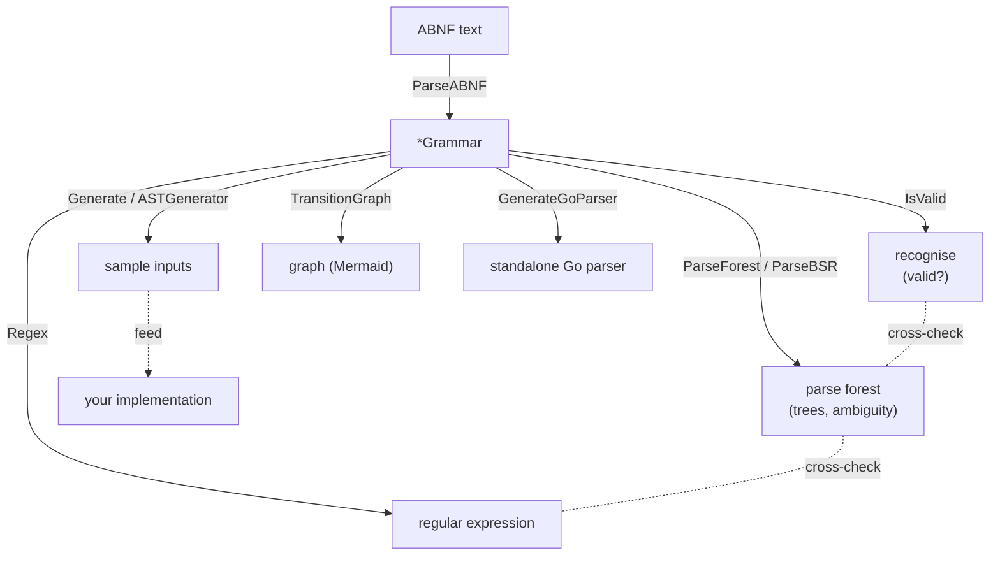
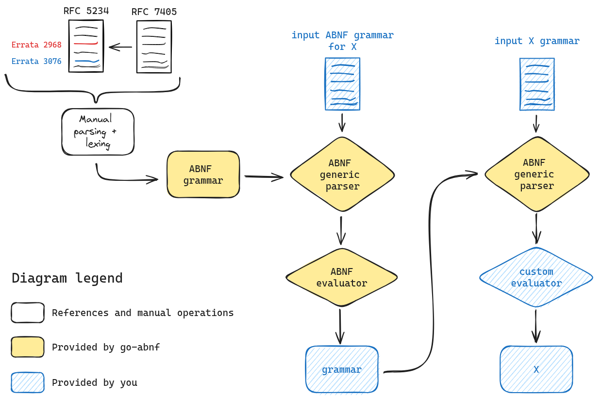

<div align="center">
	<h1>Go-ABNF</h1>
	<a href="https://pkg.go.dev/github.com/pandatix/go-abnf"></a>
	<a href="https://goreportcard.com/report/github.com/pandatix/go-abnf"></a>
	<a href="https://coveralls.io/github/pandatix/go-abnf?branch=main"></a>
	<br>
	<a href=""></a>
	<a href="https://github.com/pandatix/go-abnf/actions?query=workflow%3Aci+"></a>
	<a href="https://github.com/pandatix/go-abnf/actions/workflows/codeql-analysis.yaml"></a>
	<br>
	<a href="https://securityscorecards.dev/viewer/?uri=github.com/pandatix/go-abnf"></a>
	<a href="https://bestpractices.coreinfrastructure.org/en/projects/7840"></a>
</div>

A dependency-free Go module for Augmented Backus-Naur Form (ABNF). It parses an ABNF grammar into a data structure and then lets you *recognise*, *parse*, *generate*, *compile to regex*, *visualise*, and even *generate a standalone Go parser* from it. It implements [RFC 5234](https://www.rfc-editor.org/rfc/rfc5234) and [RFC 7405](https://www.rfc-editor.org/rfc/rfc7405), with Errata [2968](https://errata.rfc-editor.org/eid2968/) and [3076](https://errata.rfc-editor.org/eid3076/).

> [!NOTE]
> **Intended use.** Go-ABNF is built first and foremost as a **testing oracle**.
> Because it can turn one grammar into several independent representations (recognizer, parse forest, regex, generator, transition graph), it is well suited to **differential testing and fuzzing**: generate inputs from a grammar, feed them to your own implementation, and cross-check the verdicts against this library - or cross-check the library's own views against each other. It favors correctness and generality (ambiguous and left-recursive grammars, Unicode) over being the fastest production parser.

## Capabilities

- Parse ABNF into a manipulable `*Grammar` (with cycle / DAG detection).
- Recognize input against a grammar - ambiguous and left-recursive grammars included.
- Build a full **parse forest** (SPPF) or **binary-subtree set** (BSR): count trees, detect ambiguity, extract a tree.
- Compile a grammar to a **regular expression** (precedence-aware, size-bounded).
- **Generate** inputs (random walk), a minimal covering test set, or structured ASTs - for fuzzing.
- **Visualize** a grammar as a transition graph (Mermaid).
- **Generate a standalone, specialized Go parser** from a grammar (`go generate`).
- Unicode code points and 64-bit numeric values; bounded against DoS.


```mermaid
flowchart TD
	A["ABNF text"] -->|ParseABNF| G["*Grammar"]
	G -->|IsValid| R["recognise<br/>(valid?)"]
	G -->|ParseForest / ParseBSR| F["parse forest<br/>(trees, ambiguity)"]
	G -->|Regex| X["regular expression"]
	G -->|Generate / ASTGenerator| S["sample inputs"]
	G -->|TransitionGraph| T["graph (Mermaid)"]
	G -->|GenerateGoParser| C["standalone Go parser"]
	S -. feed .-> SUT["your implementation"]
	R -. cross-check .- F
	F -. cross-check .- X
```

## How it works

ABNF is *self-describing*: its own syntax is written in ABNF. Go-ABNF bootstraps from a handwritten parse/evaluation of that meta-grammar, after which any valid grammar parsed by the library can in turn be used to parse new input - so the engine is generic, not specialized to ABNF.

<div align="center">
	
</div>

Two parse paths exist by design:
- **Recognition** (`Grammar.IsValid`) answers *does this input match?* by tracking the set of reachable input positions. It never materializes a tree, so it is cheap and is the reference verdict for the other paths.
- **Parsing** builds a derivation representation using a **GLL** engine [1], which handles arbitrary context-free grammars including ambiguity and (left/right/hidden) recursion. Two representations are available over the same engine: a **Shared Packed Parse Forest** [2] (`ParseForest`) and a **Binary Subtree Set** [3] (`ParseBSR`). Both expose `Valid`, `NumTrees`, `Ambiguous` and `Tree`.

Repetition (`Min*Max element`) is handled *natively*: it lowers to a single self-recursive nonterminal and the bound is enforced by a counter carried in parser state, rather than unrolled - so a grammar like `0*9999999999 "x"` costs $O(1)$ to set up instead of exhausting memory.

The generated-parser work targets BSR representation [3], in the spirit of [GoGLL](https://github.com/goccmack/gogll).

References:
- [1] _E. Scott, A. Johnstone. "GLL Parsing," in Electronic Notes in Theoretical Computer Science, vol. 253, no. 7, pp. 177-189, 2010._
- [2] _E. Scott, A. Johnstone. "GLL parse-tree generation," in Science of Computer Programming, vol. 78, no. 10, pp. 1828-1844, 2013._
- [3] _E. Scott, A. Johnstone, L. van Binsbergen. "Derivation representation using binary subtree sets," in Science of Computer Programming, vol. 175, pp. 63-84, 2019._

## Usage

Parse a grammar, then recognize or parse input:

```go
g, err := goabnf.ParseABNF(grammarBytes) // []byte of ABNF, CRLF line endings
if err != nil { /* ... */ }

ok, _ := g.IsValid("rule", input)          // boolean recognizer

f, _ := goabnf.ParseForest(input, g, "rule")
fmt.Println(f.Valid(), f.NumTrees(), f.Ambiguous())

bf, _ := goabnf.ParseBSR(input, g, "rule") // same answers, BSR representation
```

Compile to a regular expression, or render a transition graph:

```go
re, _ := g.Regex("rule", goabnf.WithMaxRegexLen(4096))

tg, _ := g.TransitionGraph("rule")
fmt.Println(tg.ToMermaid())
```

### As a fuzzing oracle

Generate inputs from a grammar to drive Go's fuzzer, even when the input format is too specific for the engine to discover on its own:
```go
func FuzzMyParser(f *testing.F) {
	g, err := goabnf.ParseABNF(myGrammar)
	if err != nil { f.Fatal(err) }

	f.Fuzz(func(t *testing.T, seed int64) {
		input, _ := g.Generate(seed, "rule",
			goabnf.WithRepMax(15),      // cap repetitions
			goabnf.WithThreshold(1024), // cap generated size
		)
		MyParser(input) // must not panic; optionally cross-check verdicts
	})
}
```

More fuzzing helpers are [documented here](examples/fuzzing/).

### As a differential oracle

The recognizer and the parse forest are independent code paths over the same grammar; agreement between them (and with your own implementation) is a strong correctness signal:
```go
ok, _ := g.IsValid("rule", input)
f, _ := goabnf.ParseForest(input, g, "rule")
if ok != f.Valid() {
	t.Fatalf("oracle disagreement on %q", input) // a bug in grammar or engine
}
```

## Code generation

Generate a standalone, specialized parser for a grammar - a jump-table GLL/BSR parser with inlined terminals, depending only on the standard library:
```go
src, _ := goabnf.GenerateGoParser(g, "rule", "myparser")
// or, straight from ABNF source:
src, _ = goabnf.GenerateGoParserFromABNF(grammarBytes, "rule", "myparser")
```

Wire it into `go generate` with the `cmd/abnf-gen` command:

```go
//go:generate go run github.com/pandatix/go-abnf/cmd/abnf-gen -in grammar.abnf -root rule -pkg myparser -out parser_gen.go
```

The generated file exposes `Parse`, `Result` (`Valid`/`NumTrees`/`Ambiguous`/ `Tree`) and `ParseTree`. Its identifiers are package-scoped, so generate **one parser per package** (e.g. a dedicated `internal/myparser/`). The generated parser is faithful to the grammar you give it: feeding the *raw* RFC 5234 ABNF self-definition produces an ambiguous parser (the defect Erratum 2968 fixes), while the corrected grammar produces an unambiguous one - choose deliberately, and assert the expected tree count in a test.

## Safety

The engines are bounded to stay usable on untrusted grammars and inputs: `WithMaxNodes` (transition graph), `WithMaxForestNodes` / `WithMaxSlots` (forest), `WithMaxRegexLen` (regex), and the generated parser's `MaxElements`. Numeric values are accepted up to 64 bits without panicking, and matching is Unicode-aware.

## Troubleshooting

### My ABNF grammar does not work

**Q**: My ABNF grammar does not work. Do you have any idea why ?

**A**: There could be many reasons to this. First make sure your grammar ends up by a newline (LF), and especially that the input content has a CR LF. As those appear the same, it is often a source of error.

### Difference between pap and bap

**Q**: Is there a difference between pap and [bap](https://github.com/ietf-tools/bap) ?

**A**: Being written in Go makes `pap` more portable and easier to embed in workflows. Beyond that, the goals differ: `bap` aims to produce meaningful end-user errors, whereas `pap` is built to *challenge* it - and goes further by building transition graphs for fuzzing Go code and by supporting Unicode code points (useful for, e.g., [TOML, which is specified in ABNF](https://github.com/toml-lang/toml/blob/main/toml.abnf)).
