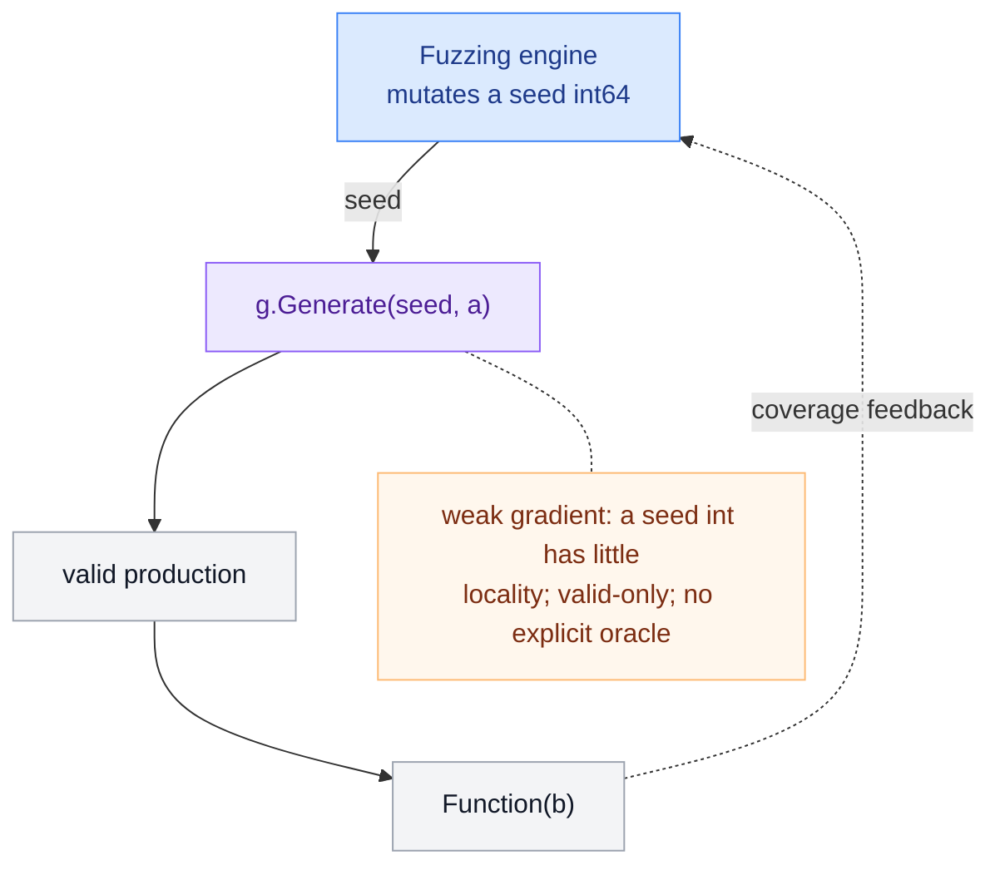
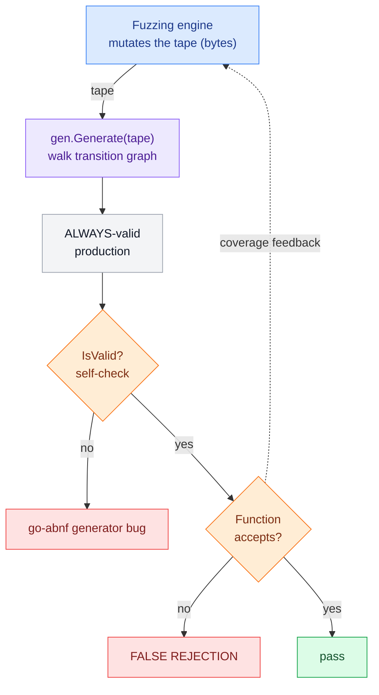
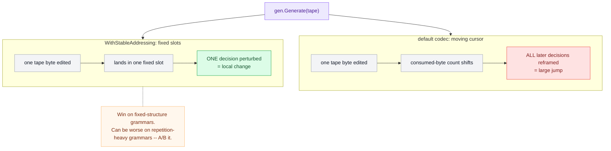
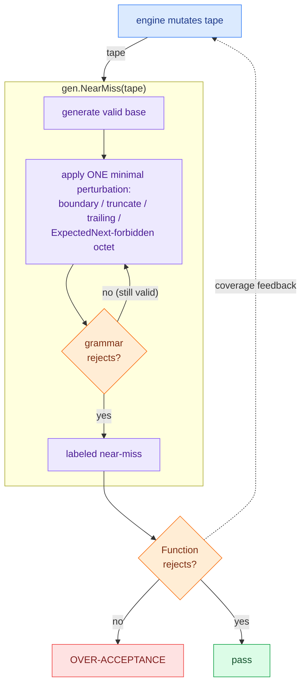
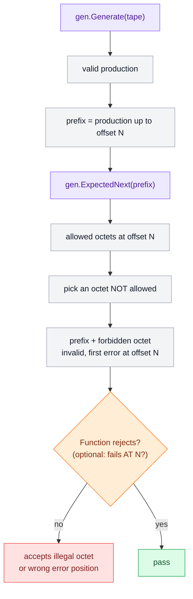
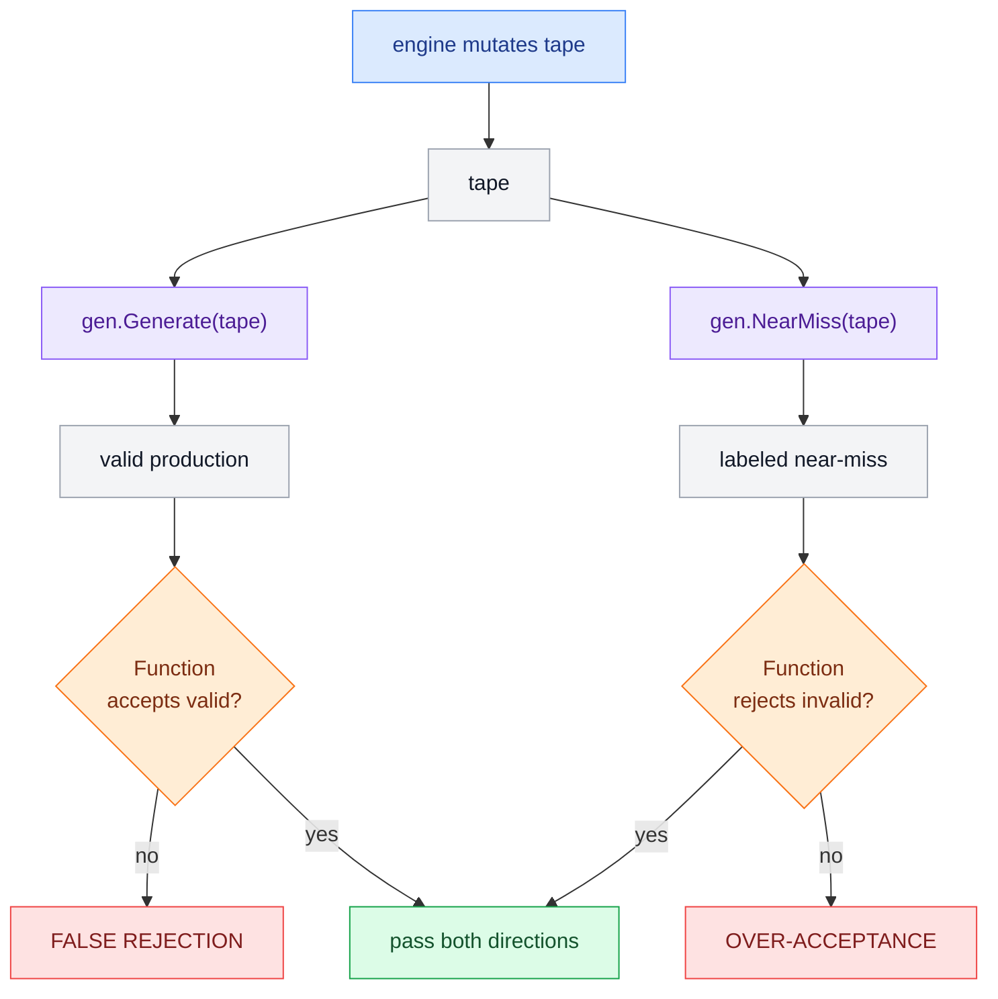
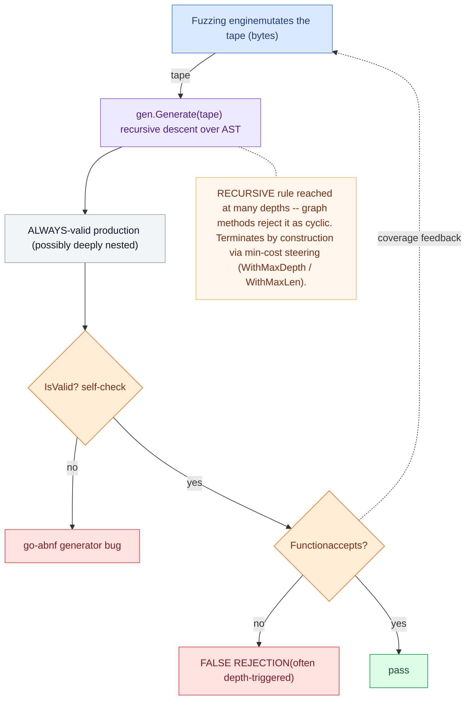
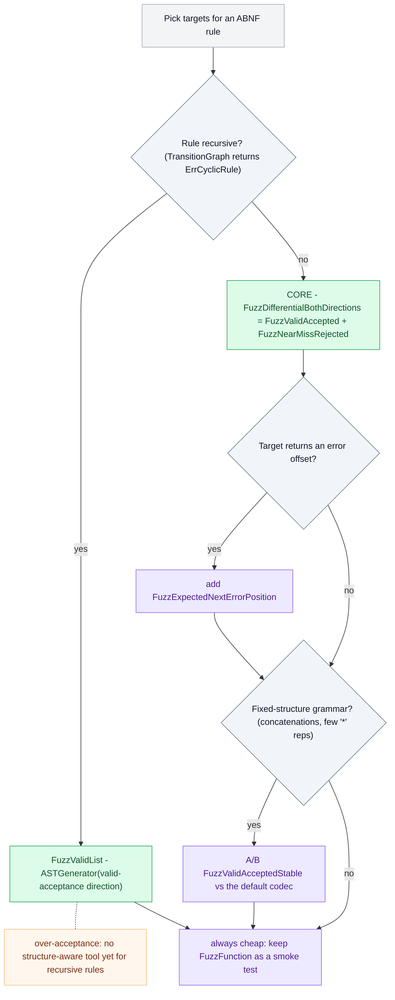

# Fuzzing targets

Each target couples the coverage-guided engine to the grammar differently. The
diagrams below render natively on GitHub.

**Legend** -- 🟦 engine · 🟪 go-abnf method · ⬜ data/input · 🟧 oracle (assertion) · 🟥 bug class found · 🟩 pass

---

## `FuzzFunction` -- baseline (seed-int generator)

The engine mutates a `seed int64`; a seed has almost no locality (a small edit
jumps randomly around production space) and only ever yields *valid* inputs.
Kept as a contrast to the tape-driven targets.

---

## `FuzzValidAccepted` -- `Generate`: structure-aware valid inputs

Every tape maps to a grammar-valid production, so the engine explores the
*grammar* instead of bouncing off the target's first syntax check, and deep
target code is always reached. **Oracle: the target must accept → finds false
rejections.**

---

## `FuzzValidAcceptedStable` -- `WithStableAddressing` codec

Addresses the tape by decision number (fixed slots) instead of a moving cursor,
so one byte edit perturbs one decision rather than reframing all later ones.
A win on concatenation / fixed-repetition grammars; can hurt repetition-heavy
ones -- so it is an opt-in to A/B against the default codec.

---

## `FuzzNearMissRejected` -- `NearMiss`: structure-aware invalid inputs

Minimal off-grammar perturbations of a valid production, each verified against
the grammar to be genuinely rejected and carrying a label. They reach the error
paths a valid-only generator can never hit. **Oracle: the target must reject →
finds over-acceptance** (a parser swallowing malformed input).

---

## `FuzzExpectedNextErrorPosition` -- `ExpectedNext`: error-position testing

`ExpectedNext` returns the octets the grammar allows after a prefix. Appending
one it forbids yields a guaranteed-invalid input whose first error sits at a
*known* offset. **Oracle: the target must reject -- and, if it reports an error
position, that position must be the injection offset.**

---

## `FuzzDifferentialBothDirections` -- combination

One tape drives both directions: the target must accept the valid production
**and** reject the near-miss derived from the same entropy. Catches false
rejections and over-acceptance together, maximizing signal per execution.

---

## `FuzzAST` -- `ASTGenerator`: recursive grammars

The transition-graph generator is a finite automaton, so it rejects recursive
rules as cyclic. `ASTGenerator` instead generates by recursive descent over the
grammar AST, so a rule reached at many depths -- nested objects, balanced
delimiters, expression grammars -- is fully supported. Every tape still maps to
an always-valid production; termination is guaranteed by precomputing each
rule's minimum expansion cost and steering toward the cheapest finish once a
depth/length budget trips, so even left recursion bottoms out. **Oracle: the
target must accept → finds false rejections, especially the depth-triggered ones
byte fuzzing rarely reaches.**

## Comparison

| Target | Finds | Pros | Cons | Requirements | Limitations |
|---|---|---|---|---|---|
| **`FuzzFunction`** (seed) | crashes on valid input only | • simplest setup • no transition graph • the only route when the rule is **recursive** | • weak gradient (a seed int has poor locality) • valid-only • no differential oracle by default | • a grammar • legacy `Generate` (`WithRepMax`, `WithThreshold`) | • won't surface false-rejection / over-acceptance without added assertions • shallow coverage exploration |
| **`FuzzValidAccepted`** (`Generate`) | false rejections | • structure-aware → explores the grammar • always clears the validity gate, so deep code is reached • self-check flags go-abnf generator bugs | • valid-only → no error paths • many no-op mutations waste cycles • gradient hurt by frame-shift on loop-heavy grammars | † + a `Function` **accept** signal | ‡ + cannot find over-acceptance |
| **`FuzzValidAcceptedStable`** | false rejections | • smoother gradient on fixed-structure grammars (one byte = one decision) | • can **reduce** locality on repetition-heavy grammars • consumes the tape less densely | † + `WithStableAddressing` | ‡ + benefit is grammar-shape-dependent → must A/B against the default codec |
| **`FuzzNearMissRejected`** (`NearMiss`) | over-acceptance (security-relevant) | • reaches the error paths a valid generator can't • every output verified-invalid → sound oracle • labeled for diagnostics • high yield | • runs `IsValid` per candidate (CPU cost) • occasional `ok=false` (that exec asserts nothing) • single-step perturbations | † + a `Function` **reject** signal | ‡ + only *near* misses (one edit) → misses deeply-malformed inputs |
| **`FuzzExpectedNextErrorPosition`** (`ExpectedNext`) | accepts-illegal-octet; wrong error offset | • guaranteed-invalid by construction (no verify needed) • tests error **position**, not just accept/reject • sharpest diagnostics | • the position check needs a position-reporting target (otherwise it just overlaps `NearMiss`) | † + ideally a target that returns an **error offset** | ‡ + `ExpectedNext` returns `ok=false` on enormous multi-byte ranges • single-octet boundary violations only |
| **`FuzzDifferentialBothDirections`** | false rejections **and** over-acceptance | • maximal signal per exec • tests the full accept/reject equivalence • a single corpus covers both | • heaviest per exec (`Generate` + `NearMiss` + 2× `IsValid` + 2× `Function`) • a failure needs direction disambiguation (the label helps) | † + **both** accept and reject signals | ‡ + union of the two single-direction limits |
| **`FuzzAST`** (`ASTGenerator`) | false rejections (often recursion/depth-triggered) | • the only structure-aware route for **recursive** rules (graph methods reject them as cyclic) • always-valid **and** terminates by construction -- min-cost steering bounds even left recursion (no stack blow-up) • reaches deep nesting / rules used at many depths that byte fuzzing rarely hits • self-check flags generator bugs | • valid-only → no error paths • cost-steering favors short productions → rare/deep branches under-sampled near the budget (sampling bias) • no `NearMiss` / `ExpectedNext` counterpart (no automaton) | § start and all reachable rules **defined + productive**; `NewASTGenerator` budgets (`WithMaxDepth`, `WithMaxLen`, `WithMaxRepeat`) -- **no** transition graph | ‡ + valid-only (no over-acceptance) • depth/size bounded by the budgets (won't explore past the ceiling) |

**†  Shared requirements** (all transition-graph targets): a fully-expanded, acyclic graph -- `TransitionGraph(rule, WithDeflateRules(true))`, where rule **recursion is rejected** but `*` repetition is fine -- plus generator budgets (`WithMaxLength`, `WithMaxReps`), and `WithMaxNodes` when the grammar itself is untrusted input.

**‡  Shared limitations**: *syntactic coverage only* -- the ABNF is a **superset** of the spec, so prose constraints (value bounds, context-sensitivity, `prose-val` holes) are not tested; and the tape indirection yields a **weaker coverage gradient** than native byte fuzzing (no-op mutations, frame-shift).

**§  `ASTGenerator` requirements**: it works directly on the AST, so it needs **no** transition graph and handles recursion natively; it only requires that every rule reachable from the start be defined and productive (otherwise `NewASTGenerator` errors), plus the depth/length/repeat budgets. The `‡` *syntactic-only* limitation still applies; the *tape-gradient* one applies too, with the added sampling bias noted in its row.

### Recommended combination

Run **`FuzzValidAccepted` + `FuzzNearMissRejected`** (or the single **`FuzzDifferentialBothDirections`**) as the core -- together they cover both false-rejection and over-acceptance. Add **`FuzzExpectedNextErrorPosition`** when the target reports error offsets. For **recursive** grammars -- which the graph methods reject as cyclic -- use **`FuzzValidList`** (`ASTGenerator`) for the valid-acceptance direction; it is tape-driven and bounded by construction, a strict improvement over the legacy seed generator for the recursive case (over-acceptance there still has no structure-aware tool -- that would need a near-miss layer over the AST generator). Keep **`FuzzFunction`** as a cheap smoke test.

The common-case routing (◇ = a question about your rule/target, 🟩 = the primary target for that branch, 🟪 = optional add-on):

In short: recursion decides the engine (AST generator vs transition graph); within the transition-graph branch the differential is the default core, error-offset reporting adds the position oracle, and fixed-structure grammars are worth A/B-testing the stable codec. `FuzzFunction` stays as a cheap smoke test in every case.
